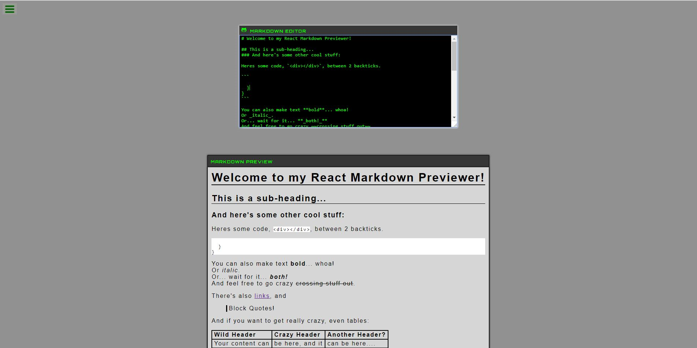

# Github Markdown Previewer

Place any Github flavored markdown in the editor and view it in the preview box below. 

## Available Scripts
**If running this project locally, run 'npm install' before following below instructions**

In the project directory, you can run:

### `npm start`

Runs the app in the development mode. 
Open [http://localhost:3000](http://localhost:3000) to view it in the browser.
